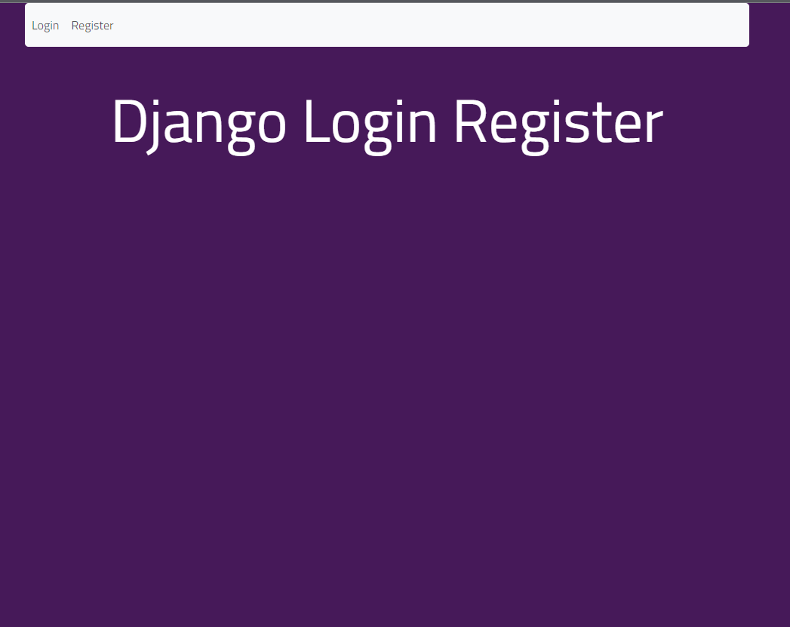
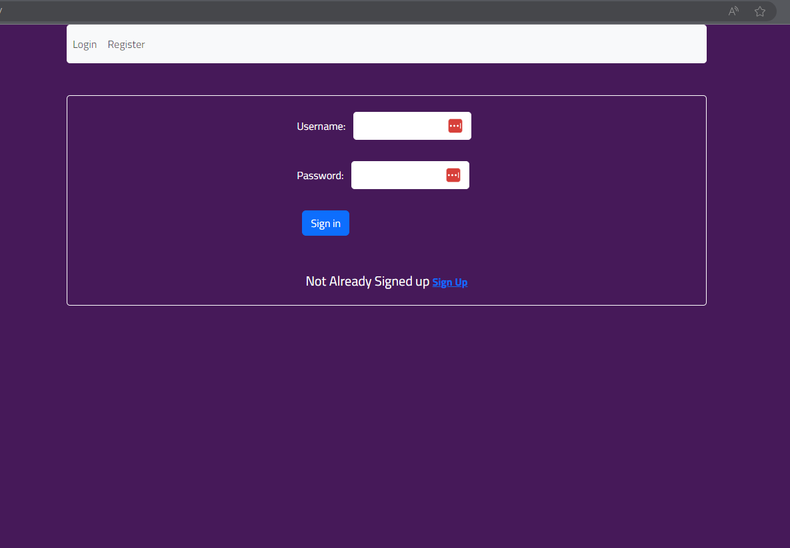
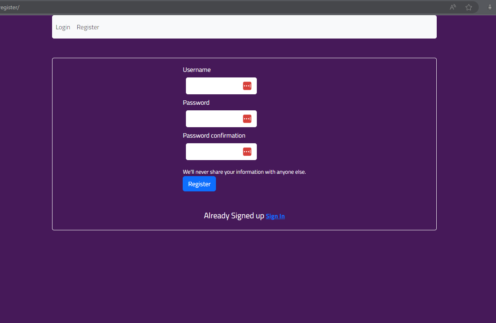
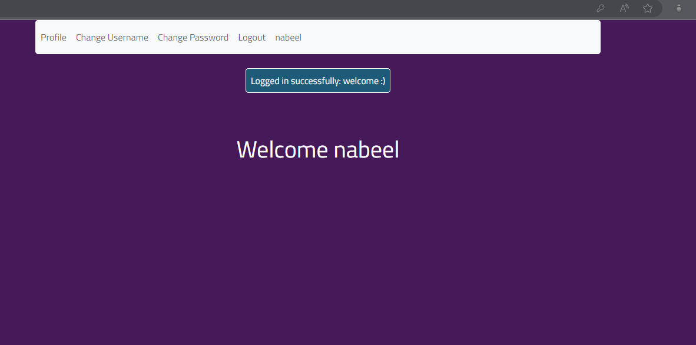
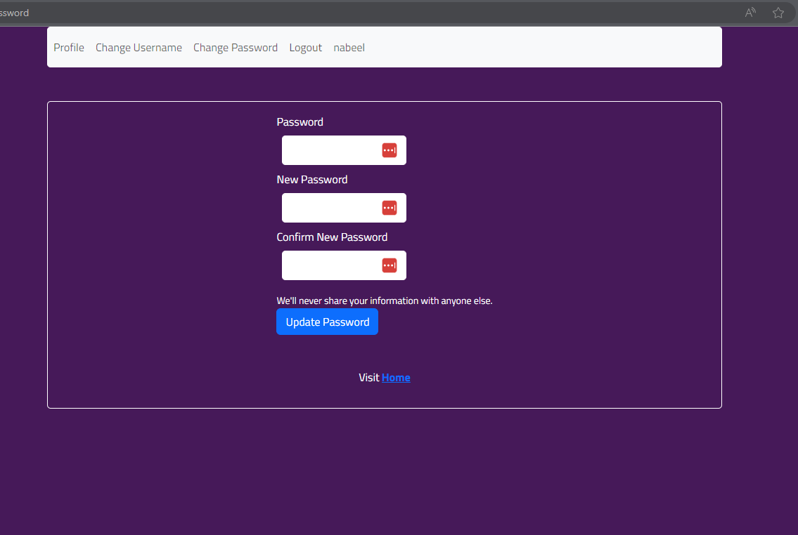
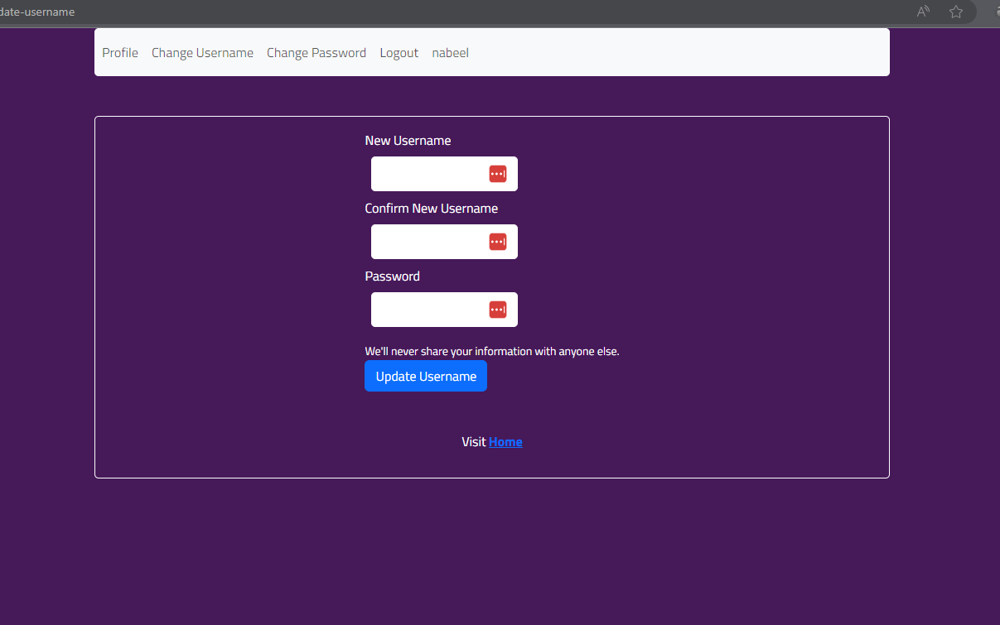

# Simple Django Login and Registration

An example of Django project with basic user functionality.

## Screenshots

| Landing Page | Login Page | Register page |
| -------|--------------|-----------------|
|  |  |  |

| Home/profile Page | Set new password | Set new Username |
| ---------------|------------------|-----------------|
|  |  |  |

## Functionality

- Log in
    - via username & password
- Create an account
- Log out
- Change password
- Change username


## Learned Topics

- Django Authenication
- Django Forms
- Error Checking
- Django Built-in User Model


## Installing

### Clone the project

```bash
git clone https://github.com/nabeelahmedjh/django-login-and-register.git
cd django_login_register
```

### Install dependencies & activate virtualenv

#### Create a virtualenv using pipenv (optional)

```bash
pipenv shell

```

#### Install dependencies

```bash
pipenv install
```

### Apply migrations (Optional)

```bash
python source/manage.py migrate
```

### Collect static files (only on a production server)

```bash
python source/manage.py collectstatic
```

### Running

#### A development server

Just run this command:

```bash
python source/manage.py runserver
```